# SmartMonitor TFM: Detección de Fallos Industriales mediante Clustering, Modelado Predictivo y Dashboard Streamlit


---

## Descripción del Proyecto

El proyecto SmartMonitor TFM se centra en anticipar fallos críticos en sistemas industriales complejos, un reto esencial dado el elevado coste que implica una parada no planificada. Aprovechando una colección de experimentos “run-to-failure” –con alta variabilidad, presencia de outliers y cambios abruptos– se ha diseñado un pipeline de preprocesamiento y modelado predictivo. Además, se ha desarrollado un dashboard en Streamlit para visualizar datos y cluster.

---

## Contenido del Repositorio

| Carpeta               | Función                                                                              |
|-----------------------|--------------------------------------------------------------------------------------|
| **app/**              | Dashboard en Streamlit (`app.py`) con visualización de KPIs y clústeres.               |
| **src/smartmonitor/** | Código reutilizable: preprocesamiento, validación y script de entrenamiento (`Complete_Project.py`). |
| **data/**             | Muestra reducida del CSV original (`date_production.zip`).                           |
| **assets/**           | Gráficos e imágenes que respaldan el análisis y el README.                           |
| **models/**           | Modelos serializados (Pickles) generados al entrenar (p.ej. `preprocessing_pipeline.pkl`). |

---

## 1. Introducción: El Reto de Anticipar Fallos

El origen de este trabajo está en la necesidad de anticipar fallos críticos en sistemas industriales complejos, donde el coste de una parada es muy elevado y la disrupción puede afectar a toda la cadena de valor. Frente a este reto, contamos con una colección de experimentos “run-to-failure”, cargados de variabilidad, outliers y cambios abruptos. 

---

## 2. Contexto del Proyecto

Para comprender el alcance de este TFM es esencial conocer el entorno en el que opera el sistema.  
**Resumen del Contexto:**  
- **Planta de Producción:** El proyecto se basa en datos recogidos de una planta de ensamblaje de dispositivos electrónicos y electromecánicos, donde la precisión en la operación es vital para sectores críticos como el médico y el de telecomunicaciones.  
- **Sensores Críticos:** Una red de 25 sensores distribuidos en 8 componentes monitoriza parámetros esenciales (temperatura, vibración, presión, etc.), capturando información tanto en condiciones óptimas como en estados previos al fallo.  
- **Ensayos Run-to-Failure:** Se han registrado múltiples experimentos en los que se observa la evolución completa hasta la falla final, lo que permite diseñar modelos predictivos robustos focalizados en anticipar eventuales incidencias.  
- **Motivación:** Al conocer en detalle las fases de deterioro, se busca minimizar paradas no planificadas y optimizar la eficiencia de la línea de producción.

_Ejemplos visuales:_

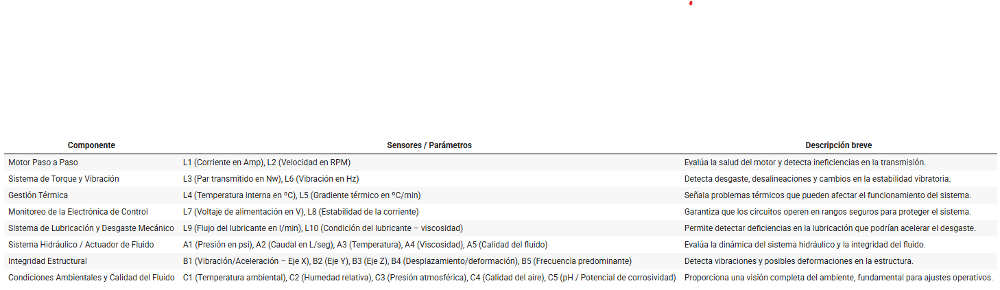

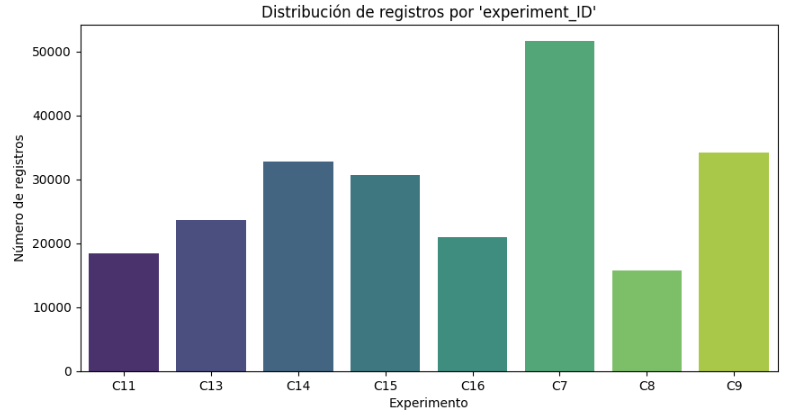

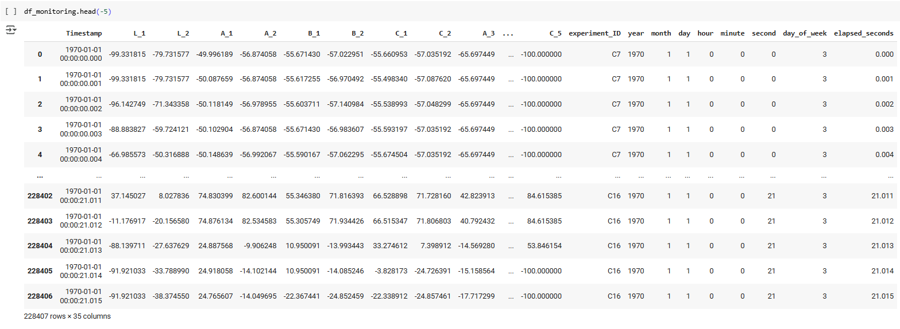

---

No basta con aplicar técnicas estándar: es imprescindible diseñar un pipeline que preserve la información relevante, resista el ruido y sea interpretativo. Así comienza este recorrido.

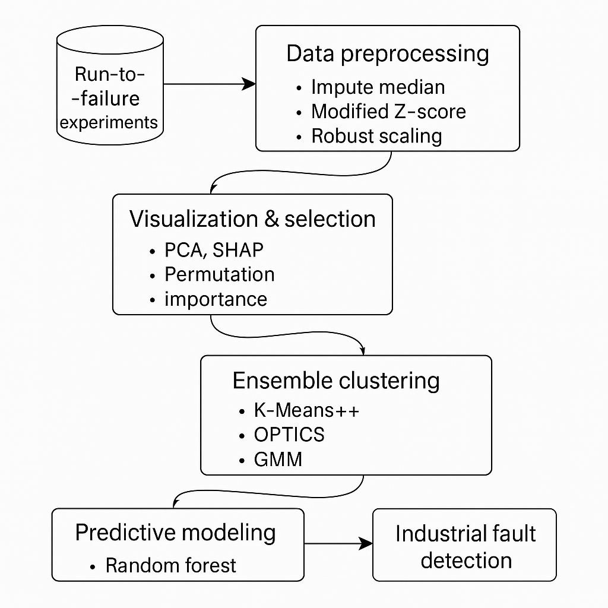

---

## 3. De la exploración a la comprensión: por qué cada experimento importa

Desde el principio, el análisis exploratorio muestra que cada experimento es un mundo, con su propio ritmo y dinámica. Unificar los datos y asignar un `experiment_ID` no es solo una cuestión de orden, sino la clave para poder comparar, modelar y extraer patrones comunes sin perder la identidad de cada caso. La limpieza de nulos se aborda con pragmatismo: si son pocos, se eliminan; si se espera que en producción sean más frecuentes, la imputación por mediana se convierte en la mejor aliada frente a los extremos y la asimetría. Contribuir en enriquece el dataset con features que además favorezcan a mantener la dinámica y el ritmo siempre mejorará el entrenamiento del modelo. Y de ahí la importancia de realizar una conversión a tipo categórico de la columna de tiempos `TimeStamp` y el procesamiento a datetime, para calcular el tiempo relativo de queda registro y extraer features temporales.

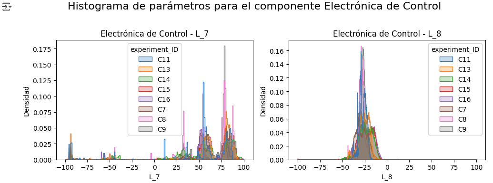

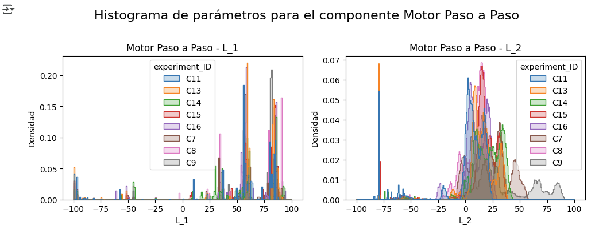
---

## 3. Los outliers: señales, no ruido

A medida que se visualizan las señales de los sensores, queda claro que los outliers abundan. Sin embargo, lejos de tratarse como errores a eliminar, el análisis revela que muchos de estos valores extremos coinciden con fases críticas o inestabilidades previas al fallo. Por eso, la estrategia es conservarlos y tratarlos con métodos robustos: el Modified Z-score con MAD sustituye a los clásicos IQR o z-score, porque capta mejor la esencia de la variabilidad industrial y protege la información crucial.

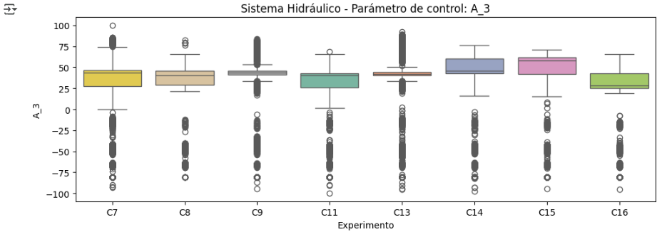

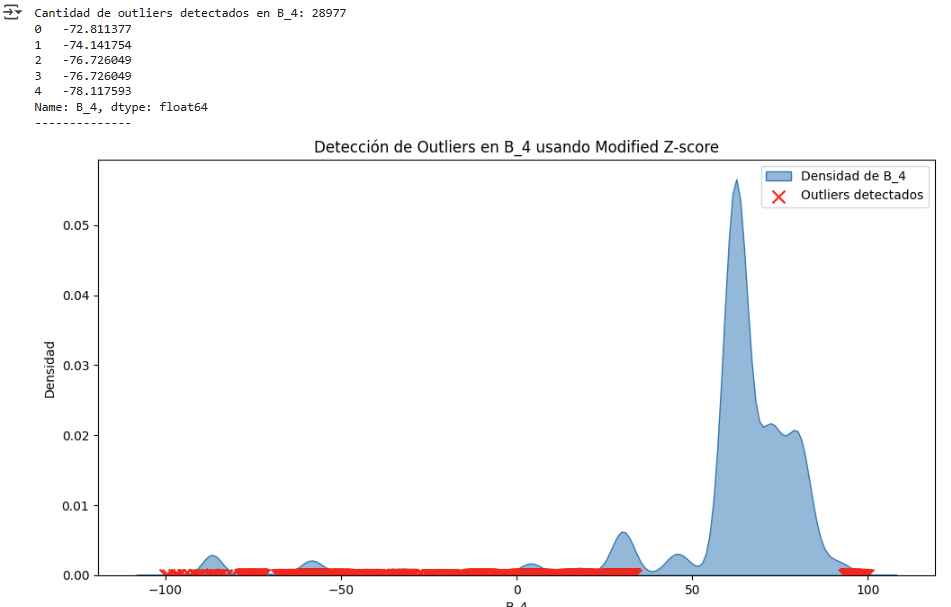


---

## 5. Visualizaciones: descubrir relaciones y anticipar el fallo

No basta con mirar medias y desviaciones. La riqueza de los datos se revela en las distribuciones completas, en las colas largas y en la correlación —o falta de ella— entre sensores. 
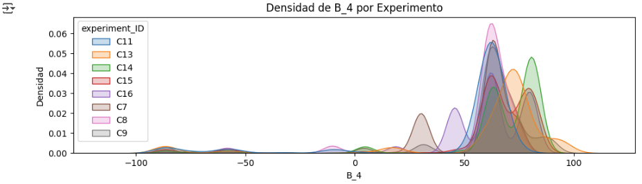

---

Los heatmaps y scatter plots permiten intuir redundancias, dependencias y también rupturas: cuando el sistema se acerca al fallo, las relaciones se vuelven caóticas. De ahí que, en las primeras fases, se conserve todo, para no perder pistas potenciales sobre el deterioro.

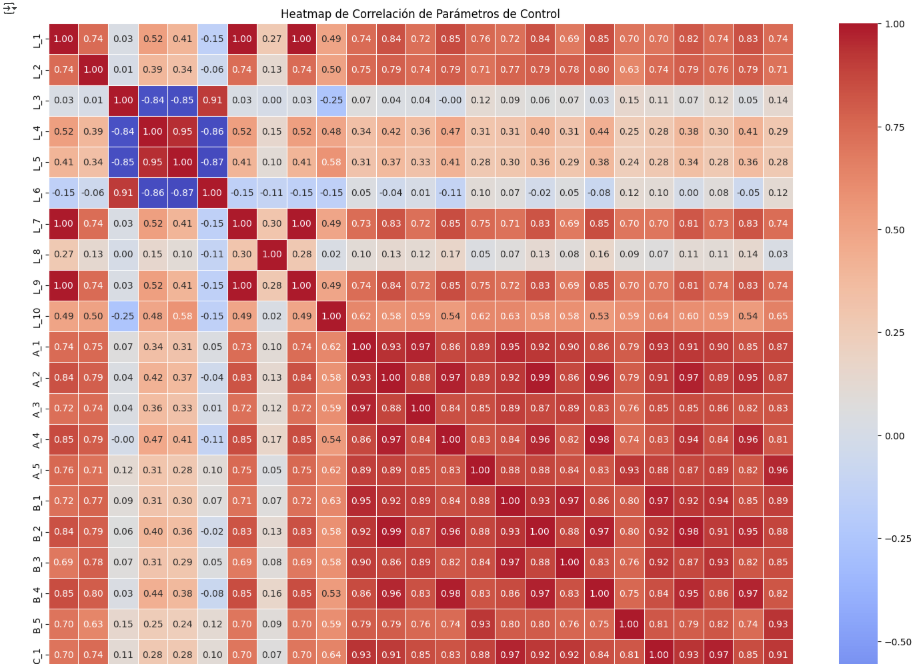

---

Una vez completado el preprocesamiento y el análisis exploratorio, el siguiente paso consiste en identificar patrones de comportamiento en los datos que permitan anticipar el fallo. Para ello, se recurre a técnicas de clustering no supervisado, siendo K-means uno de los métodos más extendidos por su sencillez e interpretabilidad. Sin embargo, la correcta aplicación de K-means exige determinar previamente el número óptimo de clusters (K) que mejor representa la estructura real de los datos. Para tomar esta decisión de forma objetiva, se emplean herramientas como el método del codo y métricas internas de validación, cuyos resultados se presentan a continuación

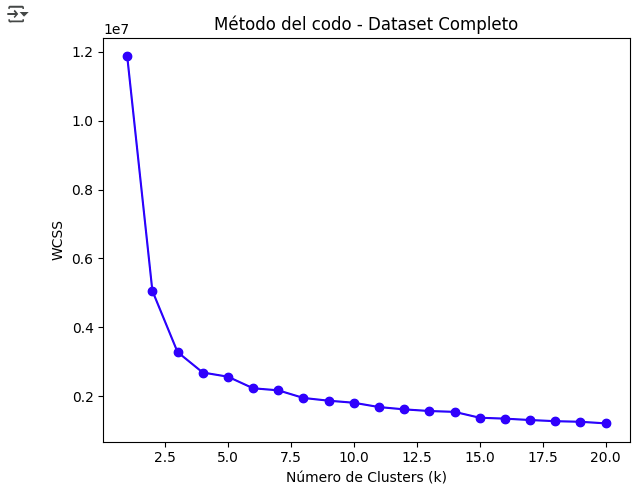

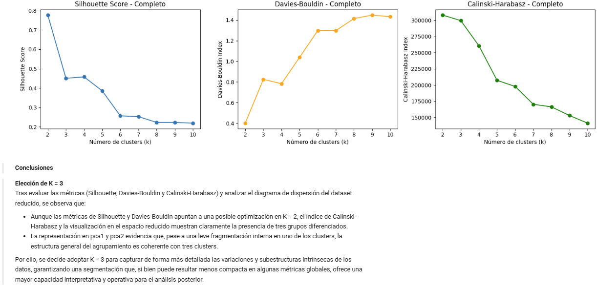

---

Aunque en este proyecto no se persigue la reducción de la dimensionalidad ni la eliminación de variables, se ha empleado el Análisis de Componentes Principales (PCA) con el objetivo de visualizar la estructura interna de los datos en dos dimensiones. Esta técnica facilita la interpretación visual, permitiendo observar si existen agrupaciones naturales que respalden la aplicación de métodos de clustering y la elección del número óptimo de clusters. De este modo, el uso de PCA se justifica como una herramienta complementaria de exploración y validación visual, sin afectar a la integridad del conjunto de variables originales utilizado en el modelado.

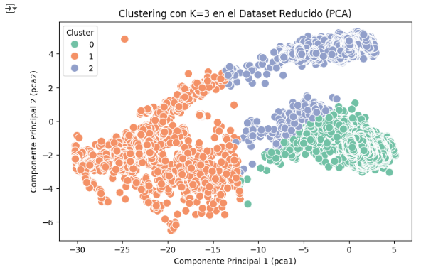

---

## 6. Hacia la objetividad: interpretabilidad y selección de variables

La interpretación visual es un primer paso, pero no puede ser el único. Surgen técnicas objetivas como el RandomForestRegressor, Permutation Importance y SHAP, que no solo confirman la intuición previa (los sensores “modificados” son críticos), sino que cuantifican el peso de cada variable en la predicción del deterioro temporal. El muestreo estratificado por fases garantiza que esta interpretación no se base solo en un periodo, sino en toda la evolución de los experimentos.

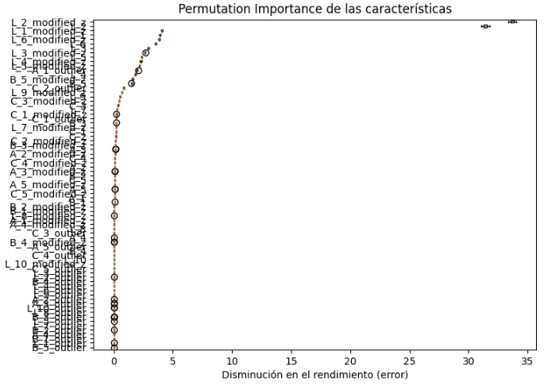

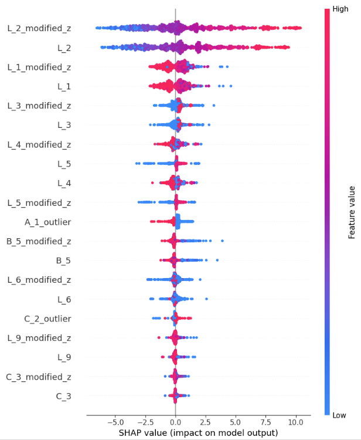

---

## 7. Del clustering clásico al ensemble: robustez frente a la complejidad

La elección de K-Means++ no es casual: su estabilidad frente a la inicialización y su reproducibilidad lo hacen preferible al azar de K-means tradicional. Sin embargo, los datos industriales desafían la simplicidad: clusters de densidad variable y cambios abruptos exigen métodos como OPTICS, más flexibles y menos dependientes del tuning exhaustivo. La combinación de K-Means++, OPTICS y GMM en un ensemble clustering permite capturar tanto los patrones persistentes como las transiciones críticas, consolidando finalmente tres estados operativos fundamentales.

---

## 8. Preprocesamiento robusto: cuando la mediana supera a la media

La comparación entre StandardScaler y RobustScaler es reveladora. Aunque StandardScaler facilita visualizaciones más limpias, es la mediana —menos sensible a los outliers— la que realmente refleja la estructura interna de los datos, como lo demuestran las métricas de cohesión y separación de clusters. En un entorno donde los extremos pueden ser la señal de un fallo inminente, RobustScaler resulta indispensable para que el modelo no pierda el norte.

---
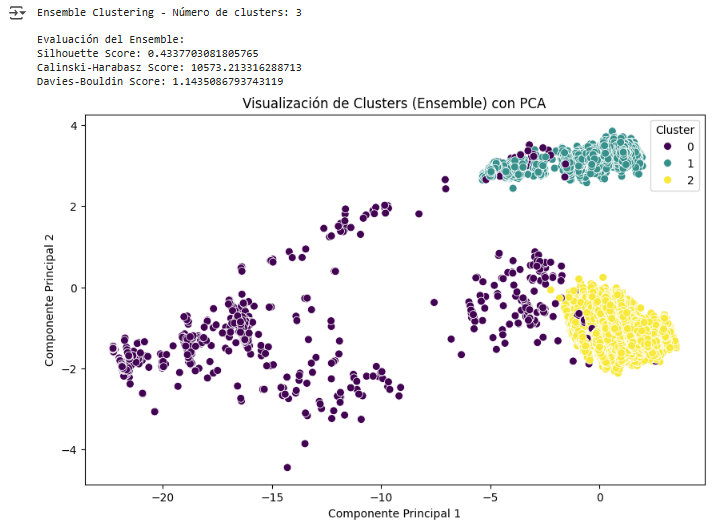

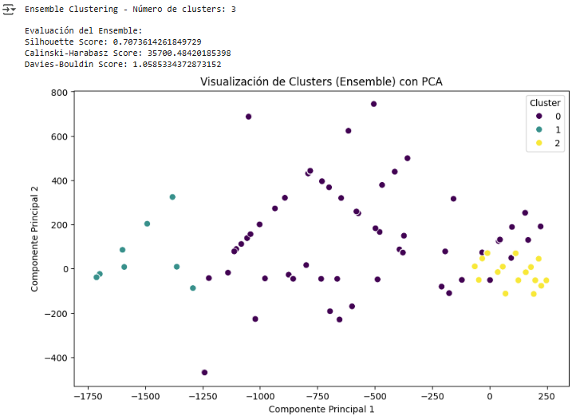

---

## 9. Validación y producción: de la teoría a la práctica

Para asegurar que las conclusiones no son fruto del azar ni de la contaminación entre experimentos, la validación cruzada agrupada (GroupKFold) se convierte en el estándar. Y, pensando en el despliegue real, se entrena un modelo auxiliar RandomForestClassifier sobre los clusters del ensemble, logrando precisión y rapidez en la asignación de etiquetas con una arquitectura ligera, ideal para producción.

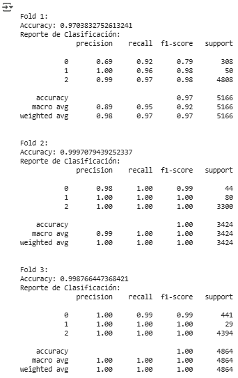
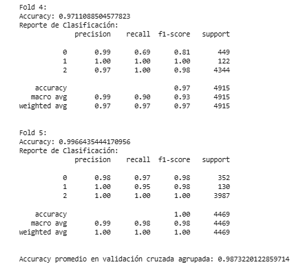

---

## 10. Conclusiones y recomendaciones: un pipeline guiado por la experiencia

Cada decisión —desde la gestión de outliers hasta la validación cruzada y la selección de escalado— responde a una necesidad detectada en el análisis de los datos reales. El resultado es un pipeline robusto, interpretable y listo para anticipar fallos en un entorno industrial exigente. Para su uso en producción, es esencial que el cliente proporcione batches con un único `experiment_ID` y reinicie el Timestamp tras cada ciclo de fallo, asegurando la trazabilidad y la correcta interpretación temporal.

---

## 11. Cierre

Este TFM no solo ha resuelto un problema técnico; ha construido una lógica de trabajo donde cada paso está fundamentado en la realidad de los datos y las necesidades de la industria. El porqué guía el cómo, y el resultado es un sistema preparado para la complejidad y el cambio.

---

## 12. Arranque Exprés y Ejecución del Dashboard

Para probar el proyecto en tu equipo, sigue estos pasos:

```bash
git clone https://github.com/furtu-71/SmartMonitor_ML.git
cd SmartMonitor_ML

# Python ≥ 3.10 recomendado
python -m venv venv
# Activa el entorno virtual:
# Windows: .\venv\Scripts\activate
# Linux/macOS: source venv/bin/activate
pip install -r requirements.txt

# lanza el dashboard
python -m streamlit run app/app.py
```

Se abrirá en **http://localhost:8501** y podrás explorar tendencias, clústeres y anomalías.

---

## 13. Bibliografía y Fuentes de Consulta

- **Kaggle - Production Plant Data for Condition Monitoring:**  
  [https://www.kaggle.com/datasets/inIT-OWL/production-plant-data-for-condition-monitoring](https://www.kaggle.com/datasets/inIT-OWL/production-plant-data-for-condition-monitoring)
---
## 14. ¿Cómo funciona el pipeline?

| Paso                    | Archivo / función                            | Descripción breve |
|-------------------------|---------------------------------------------|-------------------|
| Pre-procesado           | `src/smartmonitor/preprocessing_steps.py`   | Validación de columnas, categóricas, ingeniería temporal, duplicados, Modified Z-score, imputación mediana, escalado robusto. |
| Muestreo 10 % estrat.   | `sample_experiment_phases()`                | Equilibrio temporal (20-30-50 %). |
| Clustering base         | `Paso 5.3` de `Complete_Project.py`         | Entrena K-Means, OPTICS y GMM sobre 25 columnas *_modified_z_. |
| Ensamblado de clústeres | `Paso 5.4`                                  | Matriz de co-asociación → Agglomerative (average linkage). |
| Modelo auxiliar         | `Paso 5.5`                                  | Random Forest predice el clúster ensemble en tiempo real. |

---

## 15. Reentrenar todo desde cero

```bash
python src/smartmonitor/Complete_Project.py
```

Genera de nuevo el pipeline y los modelos en **models/**  
(tiempo ≈ 12-15 min en un portátil reciente).

---

## 16. Solución de problemas

| Síntoma / mensaje                             | Arreglo rápido |
|----------------------------------------------|----------------|
| `ModuleNotFoundError: preprocessing_steps`   | Ejecuta la app desde la raíz (`streamlit run app/app.py`). |
| Falta de RAM en la co-asociación             | Baja la fracción de muestra al 5 % o usa ≥ 16 GB. |
| Dashboard arranca lento                      | Usa `@st.cache_resource` o comenta modelos que no necesites. |

---

## 17. Contribuir

1. Haz *fork*, crea tu rama (`git checkout -b mejora-x`).  
2. Formatea con `black .` y asegúrate de que los tests (próximamente) pasan.  
3. Abre un Pull Request describiendo la mejora y las pruebas.

---

---

## 18 . Licencia y autoría

Proyecto bajo licencia MIT.  
Creado con 🛠️ y ☕ por **Fernando Urtubia**  
([@furtu-71](https://github.com/furtu-71)).

> Los datos industriales pueden ser caóticos; el código, no.
